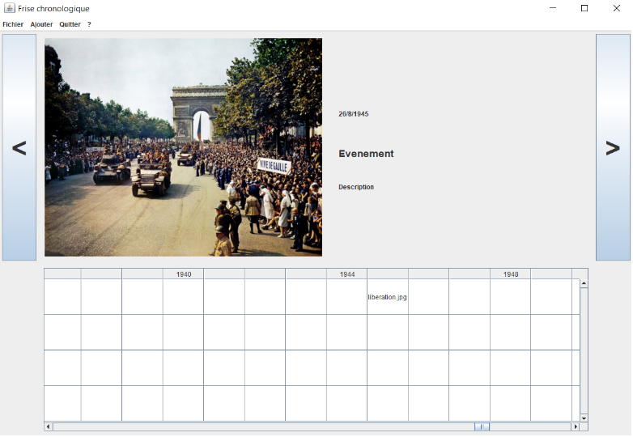

# Nom de code : Frise

## Contexte

Ce projet est un projet réalisé pour la fin du second semestre de mon DUT Informatique. Nous étions deux à travailler sur ce projet, qui avait pour but de réaliser une interface permettant de créer des frises chronologiques en Java.

## Description du projet

L'interface doit pouvoir afficher la frise chronologique, avec les différents événements qui la composent. Chaque événement doit comporter :

* Un titre
* Une date
* Une description
* Une image (pas obligatoirement)

La partie supérieure de l'interface décrit les événements de la frise, et la partie inférieure montre les images (ou le titre, s'il n'y a pas d'image) des événements dans un tableau dont chaque colonne correspond à une année dans la frise.

## Illustration du projet

<figure>
    
    <figcaption>L'interface de ce projet (Swing et AWT de Java)</figcaption>
</figure>

## Documentation technique du projet

La documentation technique (datant de la réalisation du projet) est disponible <a href="projet-frise/doc-v2-projet-frise.pdf" target="_blank">ici</a>.
