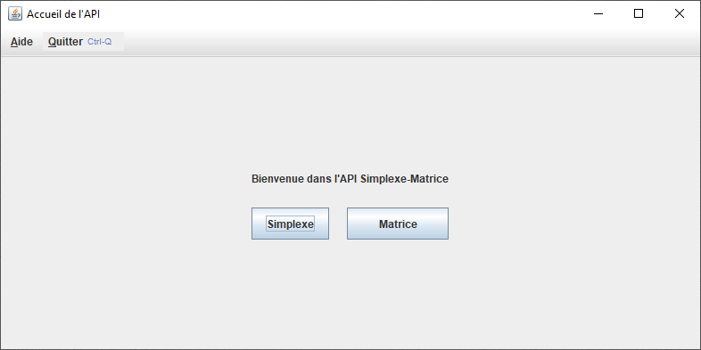
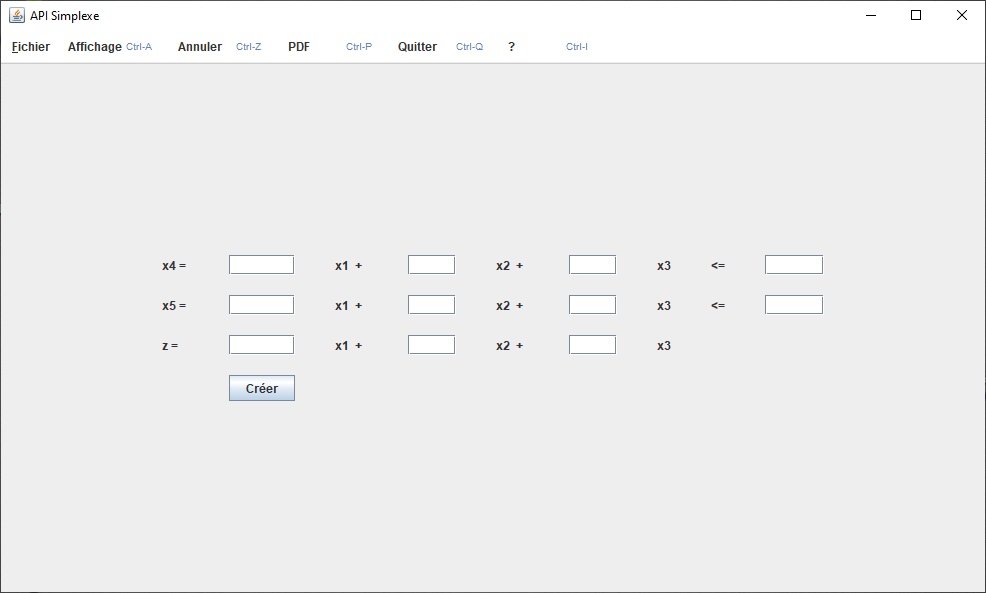
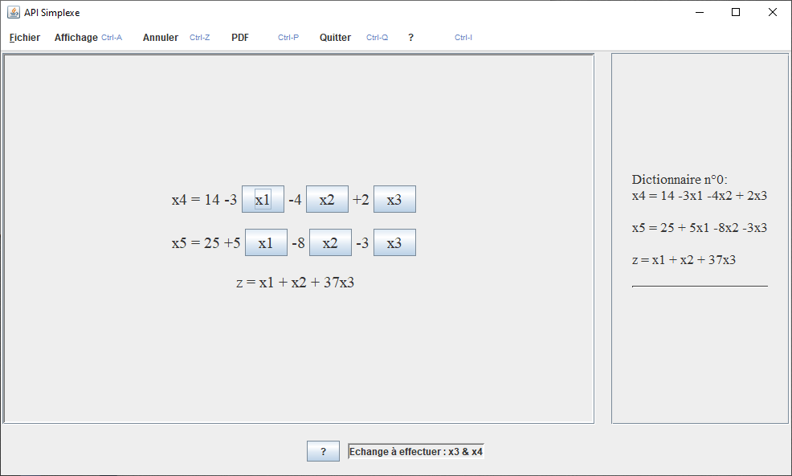

# Nom de code : Simplix

## Contexte

Ce projet est un projet tutoré réalisé pour ma seconde année de DUT Informatique, avec cinq autres étudiants. Il a été réalisé conjointement avec un autre groupe de projet tutoré (effectivement, on est sur du gros projets 👀), la finalité de ce projet étant une interface regroupant nos deux projets.

## Description du projet

Ce projet, se basant sur le langage Java, avait deux objectifs :

1. Permettre à des élèves de résoudre des **simplexes**, via une interface la plus pédagogique possible.
2. Être disponible dans une interface regroupant le projet "Matrice" (l'autre groupe, NDD) et ce dernier.

### Mais, c'est quoi un simplexe ?

Le simplexe, ou plutôt *l'algorithme du simplexe*, permet de résoudre des problèmes d'optimisation dits "linéaires" (voir [la page Wikipédia de l'algorithme du Simplexe](https://fr.m.wikipedia.org/wiki/Algorithme_du_simplexe)). Cet outil est interface permettant de manipuler un simplexe et de le résoudre. Cet interface se base sur le principe MVC et la bibliothèque graphique de base de Java : `Swing`.

Outre l'interface, cet outil propose aussi des fonctionnalités annexes telles qu'un historique des étapes de résolution ou encore un export de ce dernier au format PDF. Il est aussi possible de sauvegarder son simplexe dans un fichier ou d'ouvrir un fichier contenant un simplexe.

## Illustration du projet

> Swing n'est pas la plus belle bibliothèque que possède Java, mais c'est tout ce qu'on connaissait à l'époque."

<figure>
    
    <figcaption>La fenêtre d'accueil de l'interface du projet</figcaption>
</figure>

<figure>
    
    <figcaption>Le formulaire de création de simplexe</figcaption>
</figure>

<figure>
    
    <figcaption>Affichage d'un simplexe dans l'interface</figcaption>
</figure>

## Documentation technique du projet

Ici, quatre documents servent à décrire techniquement le projet (les liens ci-dessous mènent à des fichiers PDF) :

* <a href="projet-simplix/cahier_des_charges_projet_simplexe.pdf" target="_blank">Le cahier des charges</a>
* <a href="projet-simplix/Analyse_des_besoins_projet_simplexe.pdf" target="_blank">Un dossier d'analyse des besoins</a>
* <a href="projet-simplix/projet_conception.pdf" target="_blank">Un dossier sur la conception du projet</a>
* <a href="projet-simplix/dossier_test_projet_simplexe.pdf" target="_blank">Un dossier réunissant tous les tests effectués sur l'outil</a>