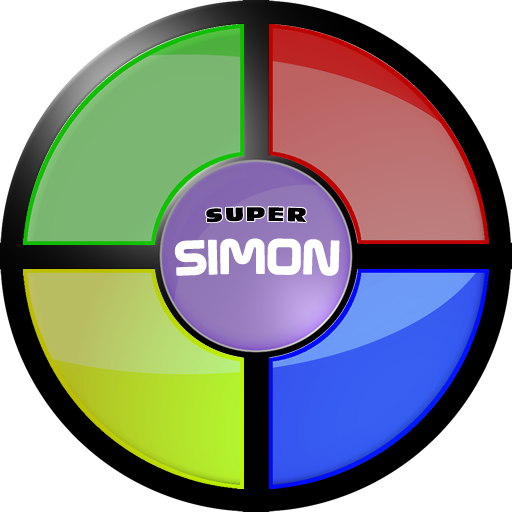
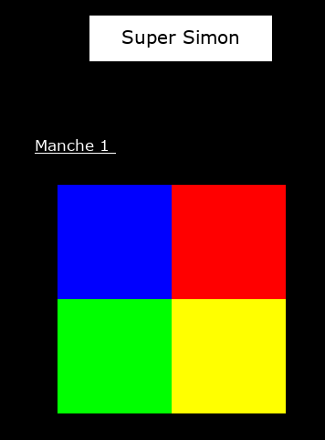
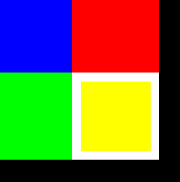

# Nom de code : Super Simon

Ce projet est un petit jeu que j'ai réalisé en solo, sur mon temps libre. Il se base sur le langage C et la bibliothèque `libgraphique`, une petite surcouche de la bibliothèque SDL, développée par des profs pour faire comprendre à des élèves comment utiliser une bibliothèque graphique.

## Contexte

Pour vous donner un peu de contexte, j'ai fait ce projet pendant ma seconde année de DUT. Ce projet (assez simple de conception d'ailleurs) était un projet pour les 1ères années. Ces derniers se plaignaient de la difficulté de ce projet, ce qui m'a poussée à voir de quoi il retournait.

Autant dire que j'ai passé certaines heures d'amphi sur mon PC, à faire ce projet plutôt qu'une écoute active du cours... 👀

Force est de constater que le projet n'était pas si difficile.

## Description

Ce petit jeu se joue avec un plateau censé représenter celui du Super Simon. Une fenêtre s'ouvre, le plateau s'affiche, et le jeu peut commencer !
Lors de la phase de démonstration, il faut bien retenir les couleurs indiqués par le curseur du Super Simon. Lorsque c'est au tour du joueur, il faut bien reproduire ce qu'a montré Super Simon, sinon c'est "Game Over" !

Sinon, pour plus d'informations, vous pouvez aussi visiter [la page Wikipédia du Simon](https://fr.wikipedia.org/wiki/Simon_(jeu)).

## Illustration du projet

<table>
    <tr>
        <td></td>
        <td></td>
    </tr>
</table>

> C'est pas très beau, mais on peut pas s'attendre à autre chose d'un projet développé en quelques heures, non ?

## Documentation technique du projet

Je vous fournis un document technique complet qui fait office de documentation pour ce projet. Vous pouvez le télécharger <a href="projet-simon/dossier_projet.pdf" target="_blank" title="Documentation du projet">en cliquant sur ce lien</a>.

## Post-scriptum

*À l'heure actuelle, ce projet ne figure pas encore dans mon repository. Je changerai ça bientôt !*
